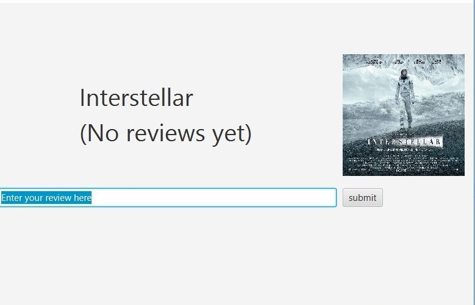
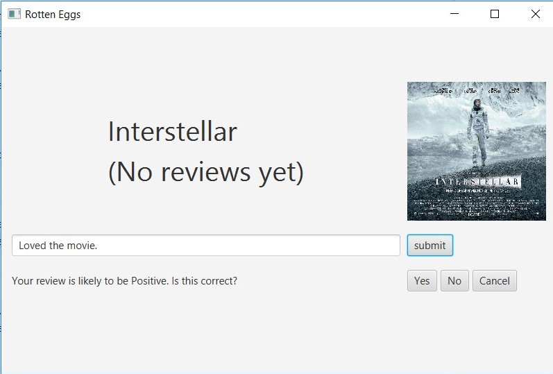
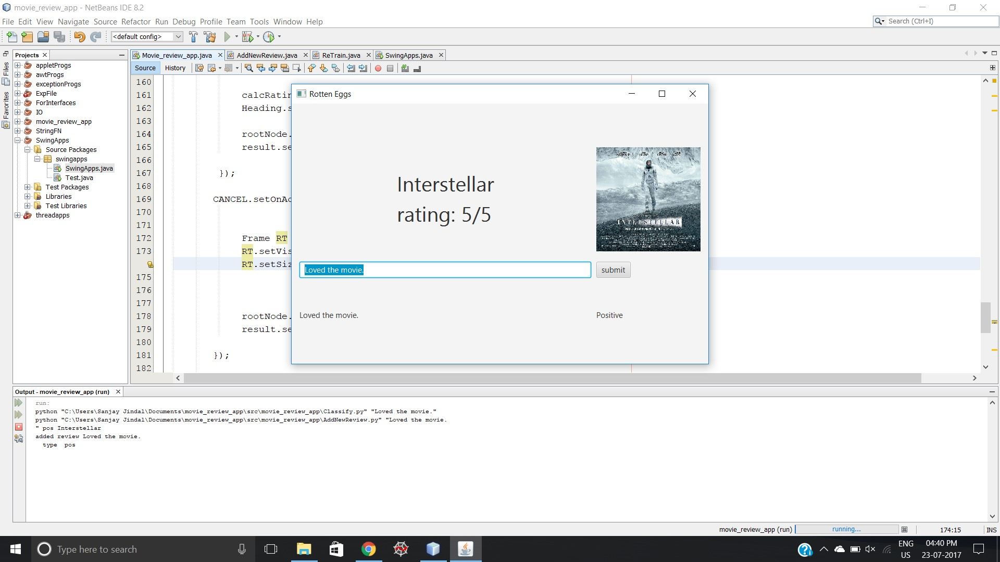
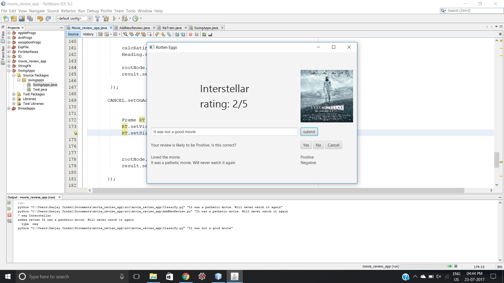
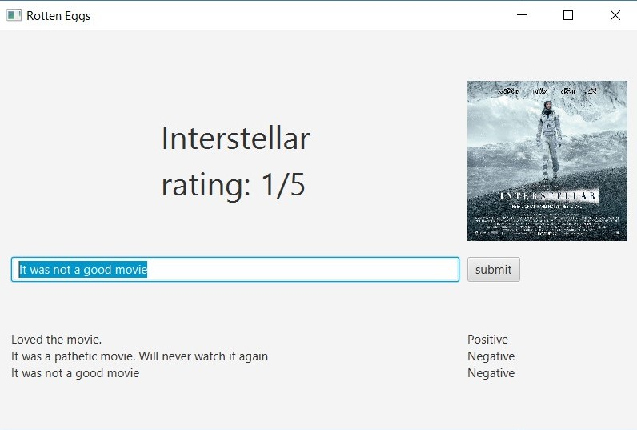

This is the interface of 'Rotten Eggs'. The front-end application is java based. The user can see the name of the movie, it's poster and can add reviews in the text box. All previous reviews of the movie can be viewed below the text box.
 

 
I added a review and clicked on submit. The classifier, which is based python working at the back-end classified the review as a positive one. The application gives an option to the user to correct the prediction if it's wrong.

 
Since, I added a positive review and the classifier predicted it correctly , I clicked on 'Yes' and the review was added in the reviews section. The classification is shown adjacent to the review. The app also calculates rating based on all reviews.
 

 
To test, I also added a negative review which was predicted correctly and was added to the review section which became the second review. Now, I added a new review and clicked on submit but this time it predicted it wrong. So, I have provided with a feature to correct this prediction manually by pressing on 'No'. The review will be added to the review section with the corrected classification as shown below.
 

At this point, the classifier is retrained taking input of the new reviews/data that was entered. Hence, the application becomes more intelligent every time it's being used.
